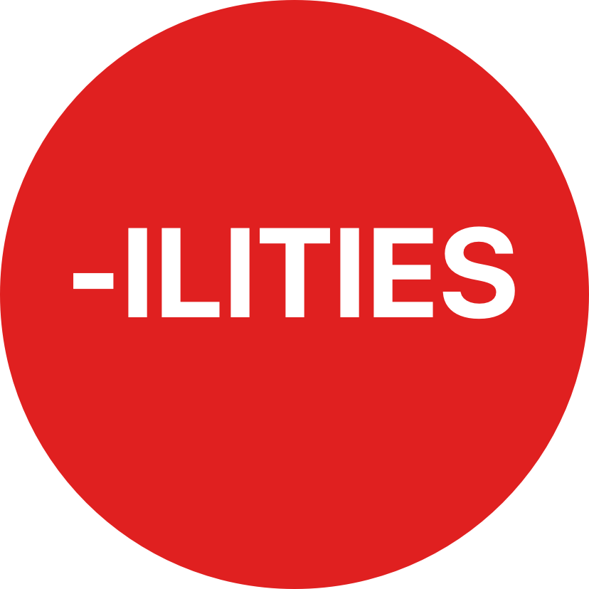
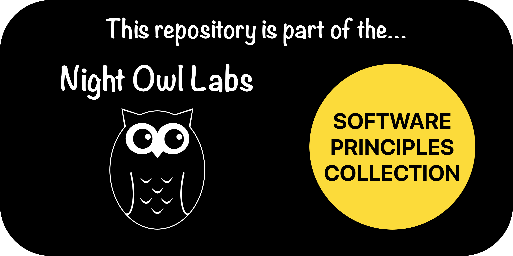

<!-- Begin README -->

    

 

    
    
    
     
    

---------------

<h1 align="center">Software "-ilities"</h1>

    

> [!NOTE]
> We based this repository on an article we wrote on Medium titled [Understanding Software “-ilities”: Key Attributes of Quality Software](https://medium.com/@scottgrivner/understanding-software-ilities-key-attributes-of-quality-software-d4b7fadc9bbe).

In [software engineering](https://en.wikipedia.org/wiki/Software_engineering), **"-ilities"** refer to a wide range of [attributes](https://en.wikipedia.org/wiki/List_of_system_quality_attributes) that determine the quality, performance, and maintainability of software systems.

These are sometimes called *architecture characteristics* or *"ilities"* due to the common suffix many of the words share.

Primarily considered [non-functional requirements](https://en.wikipedia.org/wiki/Non-functional_requirement), these attributes are critical for evaluating and ensuring that software meets user requirements and operates efficiently in various environments.

---------------

## Table of Contents

- [The Big List of Software "-ilities"](#the-big-list-of-software--ilities)
- [Resources](#resources)
- [License](#license)
- [Credits](#credits)

## The Big List of Software "-ilities"

Below is a comprehensive list of **100 "-ilities"** that I've gathered from around the web and my own work over the years. This is not an exhaustive list, but it covers many of the key attributes that determine the quality and performance of software systems. I'm sure you can think of more to add to this list, as there is no official or universally accepted list of software "-ilities."

> Once you see the list of **"-ilities"**, you will not be able to unsee it. You'll notice them everywhere in every discussion you have around software and systems, so it's time to formally meet them!

The Big List of Software "-ilities" is maintained in the [-ilities.md](./-ilities.md) file located in the root of this repository.

ex.
1. Scalability
2. Reliability
3. Maintainability
4. Usability
5. Availability

> [!NOTE]
> Over time, we will add descriptions and the importance of each **-ility**.
> For now, consult our Medium article [here](https://medium.com/@scottgrivner/understanding-software-ilities-key-attributes-of-quality-software-d4b7fadc9bbe).

## Resources

- [Understanding Software “-ilities”: Key Attributes of Quality Software](https://medium.com/@scottgrivner/understanding-software-ilities-key-attributes-of-quality-software-d4b7fadc9bbe): The Medium article we based this repository on.
- [List of system quality attributes](https://en.wikipedia.org/wiki/List_of_system_quality_attributes): Wikipedia article.
- [Non-functional requirement](https://en.wikipedia.org/wiki/Non-functional_requirement): Wikipedia article.

## License

This project is released under the terms of the **MIT License**, which permits use, modification, and distribution of the code, subject to the conditions outlined in the license.
- The [MIT License](https://choosealicense.com/licenses/mit/) provides certain freedoms while preserving rights of attribution to the original creators.
- For more details, see the [LICENSE](LICENSE) file in this repository. in this repository.

## Credits

**Author:** [Night Owl Labs, LLC.](https://github.com/Night-Owl-Labs)  
**Email:** [support@nightowllabs.io](mailto:support@nightowllabs.io)  
**Website:** [nightowllabs.io](https://www.nightowllabs.io)  
**Reference:** [Main Branch](https://github.com/Night-Owl-Labs/Software-ilities)  

---------------

    

<!-- End README -->

